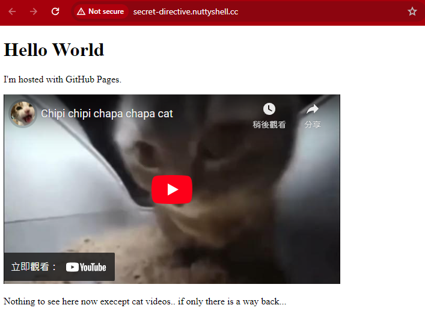
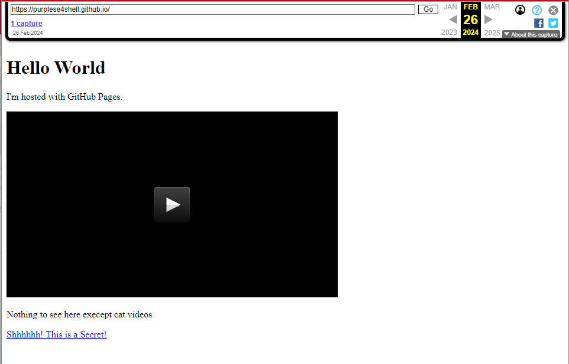

# Detective Conan 名偵探柯南 (Misc) (466 points, 17 Solves)

Solved by Mini-Touch/Johnnnny

### Challenge Description:

```
There is only one truth! But the truth is in the past...if only there is a way back...
真相永遠只有一個！但係真相只存在於過去...如果有部時光機就好喇...

Author 作者: PurpleSe4shell
```

A .eml file given to us, and when we open it, we can see the following message:


And a photo is also attached on the email:


We have save the .jpg file and see the .jpg file description, we have notice the title in the description have point to the secret-directive.nuttyshell.cc


Then We try to enter the secret-directive.nuttyshell.cc to our browser, and we found that there only have cat video and hint
"I'm hosted with GitHub Pages."
"Nothing to see here now execept cat videos.. if only there is a way back..."


When taking about going back, we have think of wayback machine, so we have try to enter the link to the wayback machine
but only the same pages show up


So we have decide to lookup the domain name using [mxtoolbox.com](https://mxtoolbox.com/DnsLookup.aspx)


we can see it's a CNAME record pointing to "purplese4shell.github.io"
Then we try to enter "purplese4shell.github.io" into the wayback machine
And the following pages appear, simply just the cat video but it also have serect link "Shhhhhh! This is a Secret!"


And we click on to the link and link to a google drive "https://drive.google.com/file/d/1F_EpcMEGODsijaKuo_4zrab48b6GzQJS/view?usp=drive_link"

When we open the google drive, we will see the .txt file and the flag is inside


Flag

> PUCTF24{B3_m1nDfuL_0f_ur_D1giTaL_F00tprint_i2ofma58b}
