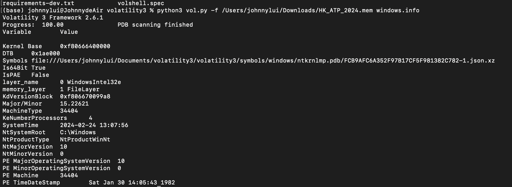
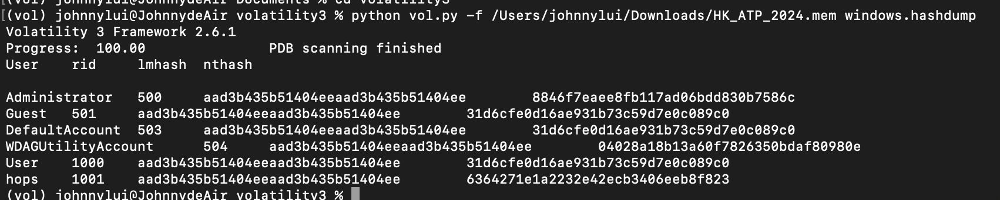
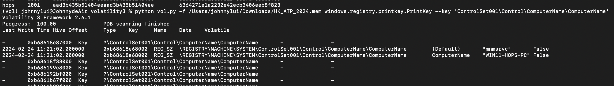
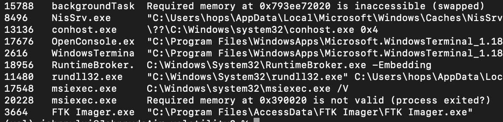

# Memory Forensic: ATP - 1 記憶體取證: ATP - 1

Solved by Mini-Touch/Johnnnny

Description:

```
You are the junior security center analyzer. Your senior would like your help in analyzing a Windows memory image as part of our ongoing investigation. The memory image in question has been acquired from a compromised system and holds valuable information that can help us understand the nature of the incident and identify potential threats.

Please find out the following information.

RAM image created UTC time (YYYY-MM-DD_hh:mm:ss)
Windows OS Version (2 numbers)
username (xxx)
Computer hostname (xxxx)
Create ram image application name (xxx.exe)
Create ram image application process ID (number)
你是網絡安全中心的初級分析員。我們正在進行的調查的一部分，您的上級希望您幫助分析 Windows 記憶體映像。 相關記憶體映像是從受感染的系統獲取的，包含具價值的信息，可以幫助我們了解突發安全事件的性質並識別潛在威脅。

請取得以下資訊。

記憶體映像建立 UTC 時間 (YYYY-MM-DD_hh:mm:ss)
Windows 作業系統版本（2 個數字）
用戶名稱 (xxx)
電腦主機名稱 (xxxx)
建立RAM映像應用程式名稱（xxx.exe）
建立RAM映像應用程式 ID （數字）
File size is about 2 GB, download maybe slow, take you time. 檔案大小差不多為2 GB, 下載需時, 但唔急既啦。

Mega: https://mega.nz/file/08tVwAzT#r6SuOpZkfOiPa9x9h5QWVxEC43CHGNdn5crN18SDHRg

Google Drive: https://drive.google.com/file/d/1rjDACx1dOfTqM8YJLnSNQDeeVkQ_Ddis/view?usp=sharing

Flag format 格式: PUCTF24{<RAM image created UTC time(YYYY-MM-DD_hh:mm:ss)>_<Windows OS Version (2 numbers)>_<username>_<computer hostname>_<create ram image application name (XXXX.exe)>_<create ram image application Process ID (number)>}

Please convert any space to _.

請將任何空白代換成 _。

Author 作者: Nightsedge
```

According to desc, we'll need to get the following info from the .mem file<br>

-   RAM image created UTC time (YYYY-MM-DD_hh:mm:ss)
-   Windows OS Version (2 numbers)
-   username (xxx)
-   Computer hostname (xxxx)
-   Create ram image application name (xxx.exe)
-   Create ram image application process ID (number)

We'll use [Volatility framework 3](https://github.com/volatilityfoundation/volatility3)

Let's run the following command to get the basic info of the .mem file

```
python3 vol.py -f /Users/johnnylui/Downloads/HK_ATP_2024.mem windows.info
```



We have the created UTC time `2024-02-24 13:07:56`

```
python vol.py -f /Users/johnnylui/Downloads/HK_ATP_2024.mem windows.hashdump
```



We can get the username from the result `hops`

Run the following comamnd to get the host name from registry

```
python vol.py -f /Users/johnnylui/Downloads/HK_ATP_2024.mem windows.registry.printkey.PrintKey --key 'ControlSet001\Control\ComputerName\ComputerName'
```



Host name: `WIN11-HOPS-PC`
We can also know the windows version from the hostname `11`

let's check for the command executed in cmd.exe

```
python vol.py -f /Users/johnnylui/Downloads/HK_ATP_2024.mem windows.cmdline.CmdLine
```



We can see `FTK Imager.exe` at the end and the process id is `3664`

now we combine the info using the format provided

```
Flag format 格式: PUCTF24{<RAM image created UTC time(YYYY-MM-DD*hh:mm:ss)>*<Windows OS Version (2 numbers)>_<username>_<computer hostname>_<create ram image application name (XXXX.exe)>_<create ram image application Process ID (number)>}

Please convert any space to \_.
```

Flag: `PUCTF24{2024-02-24_13:07:56_11_hops_WIN11-HOPS-PC_FTK_Imager.exe_3664}`
